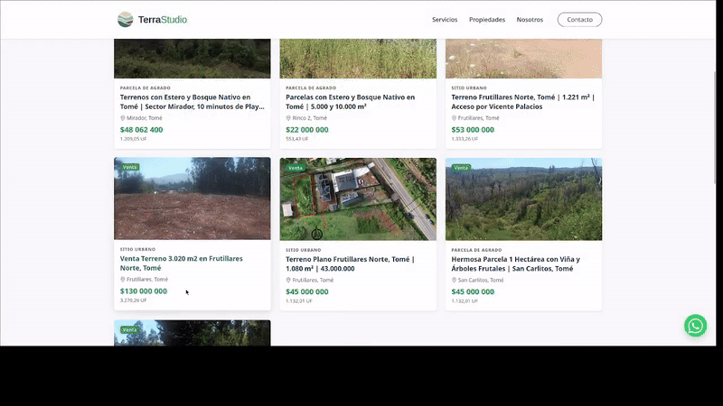
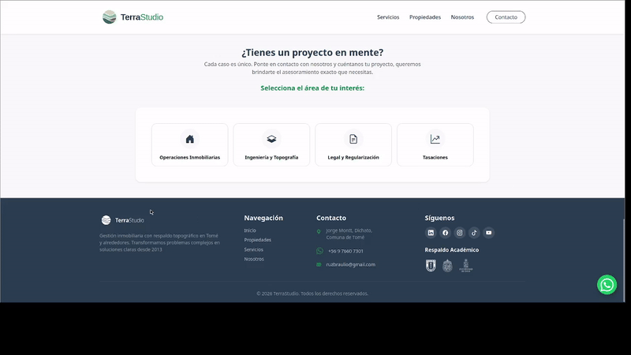

# 🌍 TerraStudio Web Platform

> Plataforma web integral para la gestión inmobiliaria y servicios topográficos en Tomé, Chile.


## Introducción

**TerraStudio** es una aplicación web desarrollada para modernizar la presencia digital de una empresa de gestión territorial. Esta empresa ofrece servicios integrales relacionados con el **Corretaje de Propiedades** y servicios técnicos de **Ingeniería y Topografía**.

El objetivo del proyecto es ofrecer una experiencia de usuario fluida, permitiendo a los clientes no solo ver propiedades, sino diagnosticar sus necesidades (legales, técnicas o comerciales) a través de flujos interactivos.

## Características Principales

* **Catálogo de Propiedades Dinámico:** Sistema de visualización de terrenos y parcelas con fichas técnicas detalladas (factibilidad de luz/agua, topografía, rol).

<p align="center">
  
</p>

* **Galería Lightbox Personalizada:** Visor de imágenes inmersivo desarrollado con JavaScript puro, con soporte para gestos táctiles (Swipe) en móviles y navegación por teclado en escritorio.
* **Wizard de Contacto Interactivo:** Un formulario paso a paso inteligente que segmenta al cliente según su intención (Comprar, Vender, Topografía, Legal) antes de enviar la solicitud.

<p align="center">
  
</p>


* **Automatización de UX:** Deep-linking que permite activar el asistente de contacto automáticamente desde fichas de propiedades o enlaces externos.
* **Diseño Responsive & Mobile-First:** Interfaz adaptada meticulosamente para móviles, ocultando elementos innecesarios y optimizando la navegación táctil.
* **whatsapp-widget:** Integración flotante para contacto directo vía WhatsApp.

## Stack Tecnológico

* **Backend:** Python, Django Framework.
* **Frontend:** HTML5, CSS3, JavaScript (ES6+), Bootstrap 5.3.
* **Base de Datos:** SQLite.

## Instalación y Uso Local

El proyecto está diseñado para que pueda ser copiado y reproducido por quien lo necesite para impulsar algún proyecto personal utilizando este repositorio armado como plantilla. Datos sensibles de la empresa no están compartidos aquí.

Para el que quiera hacerlo, puede seguir estas instrucciones:

1.  **Clonar el repositorio:**
    ```bash
    git clone [https://github.com/tu-usuario/terrastudio.git](https://github.com/tu-usuario/terrastudio.git)
    cd terrastudio
    ```

2.  **Crear y activar entorno virtual:**
    ```bash
    python -m venv venv
    # En Windows:
    venv\Scripts\activate
    # En Mac/Linux:
    source venv/bin/activate
    ```

3.  **Instalar dependencias:**
    ```bash
    pip install -r requirements.txt
    ```

4.  **Aplicar migraciones:**
    ```bash
    python manage.py migrate
    ```

5.  **Crear superusuario (para acceder al admin):**
    ```bash
    python manage.py createsuperuser
    ```

6.  **Correr el servidor:**
    ```bash
    python manage.py runserver
    ```

Visita `http://127.0.0.1:8000/` en tu navegador.

## Equipo y Créditos

Este proyecto es desarrollado y mantenido por:

* **Luciano Ruz Veloso** - *Ingeniero de Software & Analítica* - Desarrollo Fullstack y Arquitectura.

**Equipo Profesional de TerraStudio:**
* **Braulio Ruz Cerpa** - Socio Fundador & Topógrafo.
* **Javiera Cortes F.** - Área Legal.
* **Nimsy Bahamondes** - Arquitectura.
* **Scarlett Nova** - Coordinación de Proyectos.

## Licencia

Este proyecto está bajo la licencia **GNU General Public License v3.0**. Consulta el archivo `LICENSE` para más detalles.